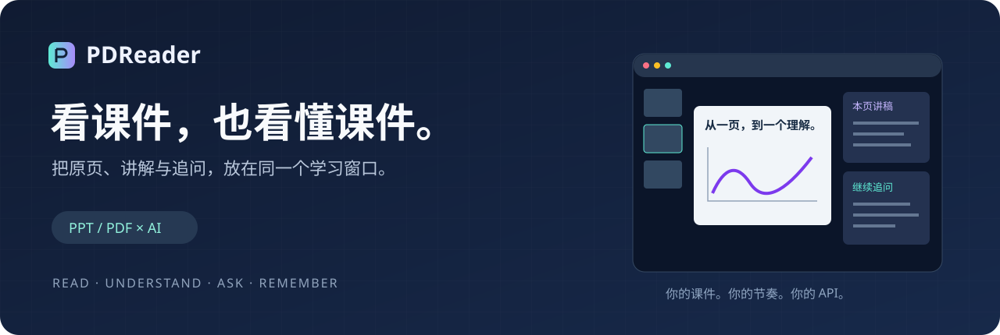
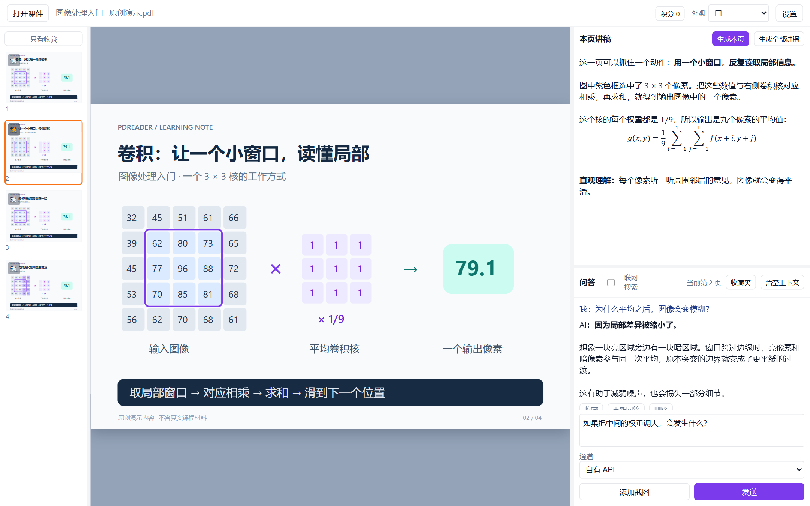
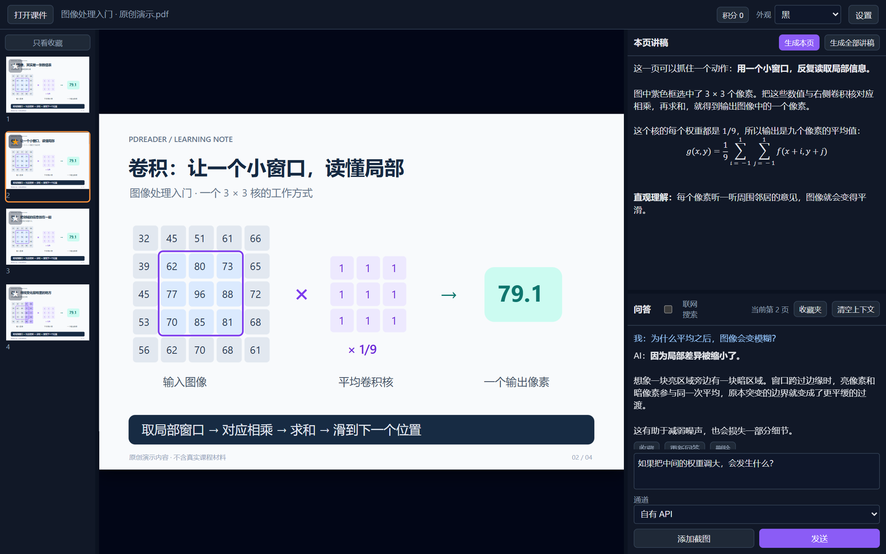

<div align="center">
  

  <p><strong>让每一页课件，都有一个可以追问的助教。</strong></p>
  <p>阅读 PPT / PDF · 逐页讲解 · 截图提问 · 收藏复习</p>

  
  
  <a href="LICENSE"></a>
  <a href="#开发与打包"></a>
  <a href="https://github.com/justajustin/PDReader/actions/workflows/tests.yml"></a>

  <p><a href="https://pdreader.fun/download"><strong>下载 Windows 客户端</strong></a> · <a href="#从源码运行">从源码运行</a> · <a href="#看看实际界面">界面预览</a> · <a href="docs/USAGE.md">使用指南</a> · <a href="README.en.md">English</a></p>
</div>

## 看到了公式，却不知道它在说什么？

上课时漏听一句，复习时就可能卡住一整页。把课件、截图和聊天窗口来回切换，又很容易丢掉上下文。

**PDReader 把原始课件、逐页讲稿和 AI 问答放进同一个桌面窗口。** 打开一份 PPT 或 PDF，停在不懂的那一页，直接问「这一步为什么成立？」。提问时会带上当前页图文，以及选取的相邻页和相关页文字。

> 适合自学、课后复习，也适合在备课时先梳理一页内容的讲解思路。

## 直接下载客户端

**不想配置源码环境或自己打包？可以直接下载安装 Windows 客户端，无需安装 Python，也无需自行部署平台后台。**

### [下载 Windows 客户端 →](https://pdreader.fun/download)

1. 打开下载页，点击「下载 Windows 安装包」。
2. 在 Windows 电脑上运行安装包，按提示安装并打开 PDReader。
3. 打开一份 PPT 或 PDF，开始生成讲稿和提问。AI 模型调用或平台积分的费用，以所选服务为准。

目前支持 **Windows**。打开 PPT / PPTX 需要本机安装 PowerPoint 或支持 COM 自动化的 WPS；PDF 不需要 Office。若从微信打开下载页，请点右上角「… → 在浏览器打开」后下载。手机扫码可以访问下载页，安装包需要在 Windows 电脑上使用。

<details>
<summary>查看客户端下载二维码</summary>

<p align="center">
  <a href="https://pdreader.fun/download">
    
  </a>
</p>

图片中的版本号和安装包大小是截图时的信息，**以下载页实际显示为准**。下载站安装包和本仓库源码的版本可能不同。

</details>

想修改代码或自行构建？继续查看 [从源码运行](#从源码运行) 和 [开发与打包](#开发与打包)。

## 看看实际界面



<details>
<summary>看看深色模式</summary>



</details>

*以上预览使用真实前端渲染；课件插图、讲稿与问答是专门编写的演示内容，不代表某次模型实测结果。*

## 一次学习，从打开课件到真正理解

- **看原页，少切窗口。** 支持 `.ppt`、`.pptx`、`.pdf`，拖入打开；缩略图、收藏筛选和可调整的三栏布局，方便定位重点。
- **给每一页补上讲解。** 根据本页图文生成中文讲稿，也可以批量生成整份课件的讲稿；已有讲稿保存在本地缓存。
- **不懂哪里，就问哪里。** 围绕当前页追问，粘贴或添加截图；支持流式回答、重试、清空上下文和问答收藏搜索。
- **公式与图示一起理解。** 用 KaTeX 显示公式；明确要求可视化时，可呈现受支持的 SVG、三维曲面和动画，例如卷积核滑动、采样与梯度方向。效果取决于模型输出。
- **使用自己的 API。** 填写 Base URL、API Key 和模型名称即可连接兼容的模型服务；看图需要模型支持图像输入，联网搜索需要服务支持对应工具。
- **按习惯阅读。** 浅色、深色、跟随系统和护眼主题；支持提取部分内嵌媒体与超链接，兼容程度取决于文件和媒体格式。

## 从源码运行

### 1. 准备环境

- **Windows 10 / 11，64 位**，Python **3.11+**。
- 打开 **PPT / PPTX** 需要安装 Microsoft PowerPoint 或支持 COM 自动化的 WPS 演示；**PDF 不需要 Office**。
- 桌面窗口需要 **Microsoft Edge WebView2 Runtime**。

### 2. 从源码运行

在 PowerShell 中执行：

```powershell
git clone https://github.com/justajustin/PDReader.git
cd PDReader
py -3.11 -m venv .venv
.\.venv\Scripts\python.exe -m pip install -e ".[dev]"
.\.venv\Scripts\python.exe -m ppt_study
```

无需激活虚拟环境，也不需要 Node.js。请从仓库目录运行；当前源码布局依赖仓库内的 `web/` 资源。

### 3. 打开课件，问第一个问题

1. 点击「设置」，填写模型服务的 Base URL、API Key、模型名称，然后测试连接。
2. 选择「自有 API」通道，拖入一份 PPT 或 PDF。
3. 点击「生成本页」，或者直接问：**「请用一个直观例子解释这一页，并指出最容易误解的地方。」**

更详细的配置、快捷操作与常见问题见 [使用指南](docs/USAGE.md)。

### 只连接自己的模型服务

客户端保留可选的平台积分接口。默认情况下，它会联系配置的平台进行设备登记、余额查询、使用统计和更新检查；自有 API 的模型请求则直接发往你设置的服务。

若只想使用自有 API，可以在启动前禁用所有平台连接：

```powershell
$env:PPT_STUDY_DISABLE_PLATFORM = "1"
.\.venv\Scripts\python.exe -m ppt_study
```

此时仍可使用自有 API 阅读、生成讲稿与问答，平台积分、统计和在线更新不可用。此选项不会阻止你主动打开的网页或课件中的外部链接。

## 数据放在哪里？

课件解析、页面缓存、已生成讲稿和收藏保存在本地。调用 AI 时，会发送当前页图文、选取的课件上下文、问题及附加截图；这些内容交由所选模型服务处理。

设置默认保存在 `%APPDATA%\PPTStudyCompanion\`。**API Key 当前以明文保存于本机 `settings.json`**，不要把该目录或含密钥的截图上传到 Issue。默认的平台统计还会包含设备标识、课件文件名、页数和使用事件；详见 [数据与联网说明](docs/PRIVACY.md)。

## 开发与打包

2026-09-25 发布前在 Windows / Python 3.13.9 本地运行 **183 项客户端测试，全部通过**。这不是云端 CI 结果；Python 3.11 / 3.12 的云端验证状态请查看 [GitHub Actions](https://github.com/justajustin/PDReader/actions/workflows/tests.yml)。

```powershell
# 运行客户端测试
.\.venv\Scripts\python.exe -m pytest -q

# 生成便携应用目录：dist/PDReader/
powershell -ExecutionPolicy Bypass -File scripts/build_exe.ps1

# 生成安装包：dist/PDReaderSetup.exe
powershell -ExecutionPolicy Bypass -File scripts/build_installer.ps1
```

安装包脚本优先使用 Inno Setup 6；未安装时使用随仓库提供的 PyInstaller 安装器方案。自行构建的安装包不含代码签名。本仓库源码版本为 **0.2.14**。预构建 Windows 安装包通过上方的 [客户端下载页](https://pdreader.fun/download) 提供，安装包版本以下载页为准；本仓库保留源码与构建脚本。

代码入口：`src/ppt_study/app.py`；桌面桥接：`api.py`；课件处理：`ingest.py`；模型通信：`ai_client.py`；界面：`web/`。更多说明见 [开发指南](CONTRIBUTING.md)。

## 一起把课件阅读做得更好

欢迎提交可复现的文件兼容问题、改进公式与图示显示，或让初次配置更顺手。报错时请附 Windows 版本、文件类型、复现步骤及脱敏截图；如果愿意提供示例文件，请使用可以公开分享的内容。

- [报告问题](https://github.com/justajustin/PDReader/issues/new?template=bug_report.yml)
- [提出建议](https://github.com/justajustin/PDReader/issues/new?template=feature_request.yml)
- [贡献指南](CONTRIBUTING.md)

如果它帮你看懂了一页课件，欢迎留一个 Star，让更多正在自学的人发现它。

## 开源范围与许可

本仓库开源 **PDReader 桌面客户端**，包括界面、课件处理、AI 接入、客户端测试与打包脚本，采用 [MIT License](LICENSE)。平台积分服务的运营后台、支付处理和服务端部署不在此仓库中；使用自有 API 不需要部署这些服务。公开源码包使用充值提示占位图，不包含个人收款码。

第三方组件保留各自的许可，见 [THIRD_PARTY_NOTICES.md](THIRD_PARTY_NOTICES.md)。AI 输出可能出现错误，学习时请结合原课件核对。
